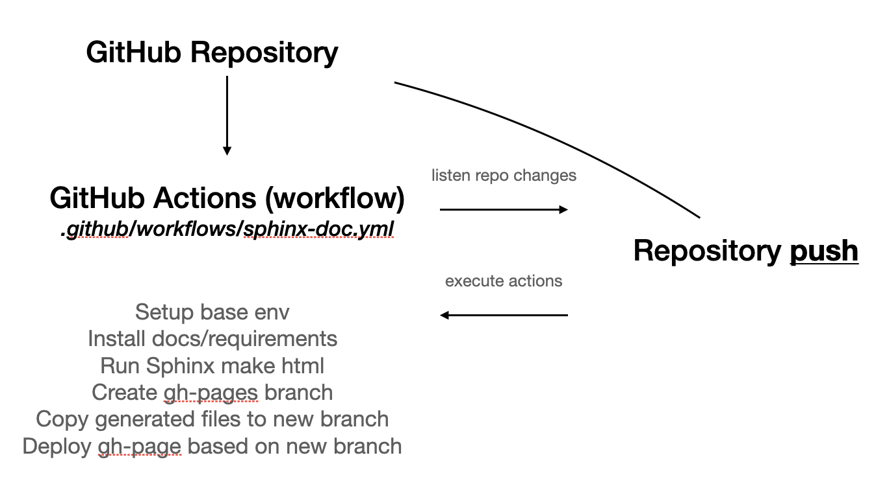

# Documentation (Sphinx)             

PrimeQA uses Sphinx for documentation.  Before continuing make sure you have installed PrimeQA
with `docs` extras.  For example, from the top level of the project:

```shell
pip install .[docs]
```

The documentation can then be built with:

```shell
cd docs
make html -e SPHINXOPTS='--keep-going --no-color -w "{log_file}"'   
```

This will generate the documentation in HTML.

## Docker       

The documentation can also be built and served from a Docker container.

```shell
VERSION=$(cat VERSION)
cd docs

# build image
./buildDocker.sh

# run container
docker run -p 80:80 --rm -d --name primeqa-docs primeqa-docs:${VERSION}
```

# Deploying a Sphinx project      
* [Sphinx doc](https://www.sphinx-doc.org/en/master/tutorial/deploying.html)         
* [GitHub Pages](https://pages.github.com/): GitHub Pages is a simple static web hosting tightly integrated with [GitHub](https://github.com/): static HTML is served from one of the branches of a project, and usually sources are stored in another branch so that the output can be updated every time the sources change (for example using [GitHub Actions](https://github.com/features/actions)). It is free to use and supports custom domains.



## Publishing your documentation sources on GitHub Pages           
* Sign up for a GitHub account.
* Create a new repository.
* Open the “Upload files” page of your new repository.
* Select the files on your operating system file browser (the makefiles under the docs directory, and everything under docs/source) and drag them to the GitHub interface to upload them all.
* Click on the Commit changes button.

*Note: Make sure you don’t upload the docs/build directory, as it contains the output generated by Sphinx and it will change every time you change the sources, complicating your workflow.*

* After that, you will need an automated process that performs the make html step every time the sources change. That can be achieved using [GitHub Actions](https://github.com/features/actions).
* After you have published your sources on GitHub, create a file named `.github/workflows/sphinx-doc-build.yml` in your repository  

- [workflowfile](https://github.com/primeqa/primeqa/blob/main/.github/workflows/sphinx-doc-build.yml)    

* This file contains a GitHub Actions workflow with a single job of four steps:
    1. Checkout the code.
    2. Install python and project dependencies.
    3. Copy README files into docs/ to maintain same info between docs page and packages instructions [file](https://github.com/primeqa/primeqa/blob/main/docs/scripts/copy-readme-to-docs.sh)
    4. Build the HTML documentation using Sphinx.
    5. Attach the HTML output the artifacts to the GitHub Actions job, for easier inspection.
    6. If the change happens on the default branch, take the contents of docs/build/html and push it to the gh-pages branch.

* Next, you need to specify the dependencies for the make html step to be successful. For that, create a file [docs/requirements.txt](https://github.com/primeqa/primeqa/tree/main/docs/requirements.txt) 

* And finally, you are ready to enable [GitHub Pages on your repository](https://docs.github.com/en/pages/getting-started-with-github-pages/configuring-a-publishing-source-for-your-github-pages-site). For that, go to Settings, then Pages on the left sidebar, select the gh-pages branch in the “Source” dropdown menu, and click Save. After a few minutes, you should be able to see your HTML at the designated URL.        

* If GitHub Page URL has changed, it is necessary to change all the places where that URL is used (check all markdwon -md- and rst files)       

## New package added to PrimeQA    
After a new package is added to `/primeqa`:      
- go to `/docs/api` and create a new folder with same package name  
    - add `index.md` file and copy there the README text (keep same structure used into others packages)  
- modify `/docs/api/index.rst` to add new package link access 
- modify `/docs/_templates_/custom-left-section-api-pkg.html` to add new package link access 
- modify `.gitignore` to avoid commit _autosummary generated files for the new package   
- modify `docs/scripts/copy-readme-to-docs.sh`and add the new package readme to be copied to docs automatically         

### Visitors counter        
- [Hits](https://github.com/gjbae1212/hit-counter)      
- [CountAPI](https://countapi.xyz/#api)     
    - if this approach is implemented, it is necessary to add the script call into **extrahead** block, `layout.html` file and then the callback in the desired HTML file inside **script** tag.        

