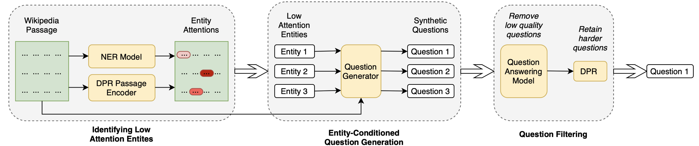

This repo contains the code to train and run the entity-conditioned question generator used in the paper:
```
Entity-Conditioned Question Generation for Robust Attention Distribution in Neural Information Retrieval 
```


## Citation

If you found our work useful, please consider citing:

```
@inproceedings{10.1145/3477495.3531878, 
    title = {Entity-Conditioned Question Generation for Robust Attention Distribution in Neural Information Retrieval},
    author = {Reddy, Revanth Gangi and Sultan, Md Arafat and Franz, Martin and Sil, Avirup and Ji, Heng}, 
    year = {2022}, 
    isbn = {9781450387323}, 
    publisher = {Association for Computing Machinery}, 
    address = {New York, NY, USA}, url = {https://doi.org/10.1145/3477495.3531878}, doi = {10.1145/3477495.3531878},
    booktitle = {Proceedings of the 45th International ACM SIGIR Conference on Research and Development in Information Retrieval}, 
    pages = {2462–2466}, 
    location = {Madrid, Spain}, 
    series = {SIGIR '22} }
```
