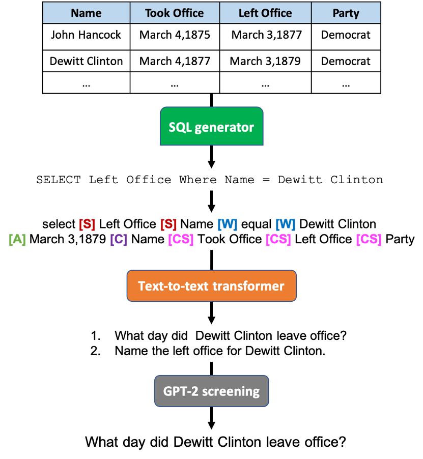

# Table Question Generation (TableQG)
The task of TableQG can be summarized as given a table, generate <question, answer> pairs such that the answer for that question can be deduced from the table.  
The primary script for TableQG is [run_qg.py](./run_qg.py).  This runs a transformer-based sequence generation pipeline as shown below:
## Pipeline


Before continuing below make sure you have PrimeQA [installed](../../README.md#Installation).

## Supported datasets
Currently supported datasets for training include:
- WikiSQL (QG for TableQA)
- SQuAD, SQuAD_v2 (QG for PassageQA i.e. MRC)
- TydiQA (Multilingual QG)

Inference can be done on any table in particular dict format. Check this [notebook](../../notebooks/qg/tableqg_inference.ipynb) for more information.

## Example Usage
An example for training the model on WikiSQL dataset:

```bash
python examples/qg/run_qg.py \
    --model_name_or_path t5-base \
    --modality table \
    --dataset_name wikisql \
    --do_train \
    --max_len 200 \
    --target_max_len 40 \
    --output_dir  models/qg/$DIR_NAME \
    --learning_rate 0.0001 \
    --num_train_epochs 4\
    --per_device_train_batch_size 32
```
Where the model_name_or_path can be any generator from huggingface ('t5', 'mt5', 'bart')

We evaluated the generated questions against the gold standard questions available in wikisql benchmark using Rogue metrics. The results are shown as follows:
    eval_loss               =     0.7898
    eval_rouge1             =    65.3456
    eval_rouge2             =      39.03
    eval_rougeL             =    59.2015
    eval_rougeLsum          =    59.2323
    eval_runtime            = 0:02:52.79
    eval_samples_per_second =     48.733
    eval_steps_per_second   =      1.528

Inference can be done on any table in particular dict format. Check this [notebook](../../notebooks/qg/tableqg_inference.ipynb) for more information.


An example usage for training the model on TydiQA dataset:

```bash
python examples/qg/run_qg.py\
    --model_name_or_path mt5-base \
    --modality passage \
    --dataset_name tydiqa \
    --do_train \
    --do_eval \
    --output_dir models/qg/$DIR_NAME \
    --learning_rate 0.0001 \
    --num_train_epochs 4\
```

We evaluated the generated questions against the gold standard questions available in TydiQA benchmark using Rogue metrics. The results are shown as follows:
    eval_loss               =     1.0944
    eval_rouge1             =    28.9264
    eval_rouge2             =    17.1576
    eval_rougeL             =     28.396
    eval_rougeLsum          =    28.4241
    eval_runtime            = 0:02:10.66
    eval_samples_per_second =     38.855
    eval_steps_per_second   =      1.217

Inference can be done for PassageQG over a given passage. Check this [notebook](../../notebooks/qg/passage_qg_inference.ipynb) for more information.
