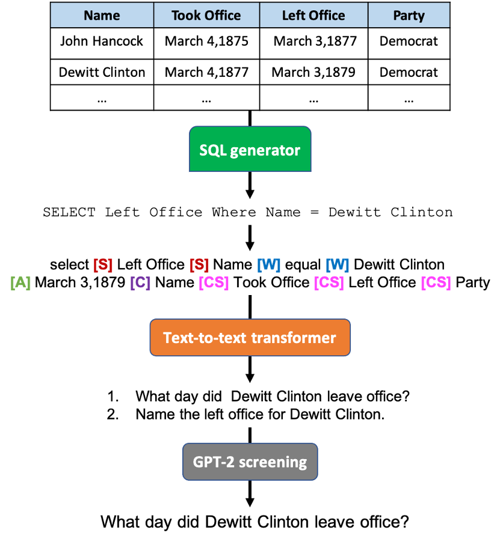

# Question Generation for TableQA
Generates synthetic question-answer pairs for tables. We first sample SQL queries from a given table, and then use a text-to-text transformer (T5) to transcribe the SQL query to a natural language question. For more details on the method check out our EMNLP 2021 paper [here](https://arxiv.org/abs/2109.07377).

## Pipeline
